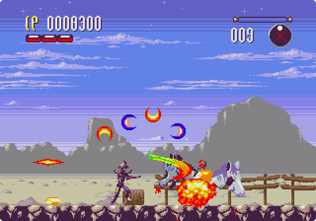
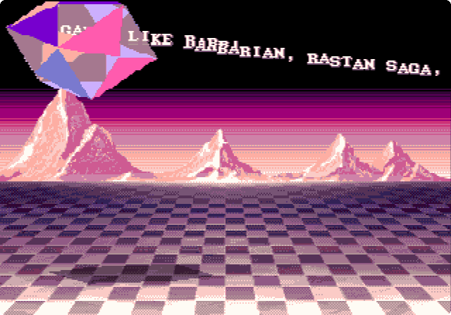
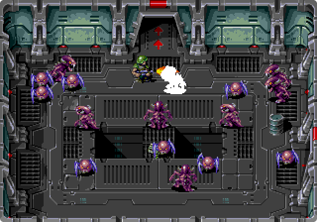
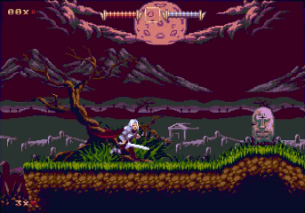

# SGDK 2.11 (April 2025)
#### Copyright 2025 Stephane Dallongeville
Github: https://github.com/Stephane-D/SGDK 
Patreon: https://www.patreon.com/SGDK

**SGDK** is a free development kit allowing development of software in **C language** for the **Sega Mega Drive**.
It contains the development library itself (with the code sources) and some custom tools used to compile resources.
SGDK uses the GCC compiler (m68k-elf target) and the libgcc to generate a ROM image. Binaries (GCC 13.2) are provided for Windows OS for convenience, but you need to install it by yourself for other operating systems (more infos about it in *HELP AND SUPPORT* section).
Note that SGDK also requires Java (custom tools require it), so you need to have Java installed on your system.

SGDK library and custom tools are distributed under the MIT license (see [license.txt](license.txt) file).
GCC compiler and libgcc are under GNU license (GPL3) and any software build from it (as the SGDK library) is under the GCC runtime library exception license (see [COPYING.RUNTIME](COPYING.RUNTIME) file)
 
## GETTING STARTED

First, you need to know that SGDK uses the C language (assembly is also possible, but not necessary) so it's highly recommended to be familiar with C programming before trying to develop with SGDK. Learning C language at same time as learning 'Sega Mega Drive' programming is definitely too difficult and you will end up getting nowhere. It's also important to have, at least, a basic knowledge of the Sega Mega Drive hardware (specifically the video system). 

### MEGA DRIVE TECHNICAL INFO REFERENCES

* And-0 - Awesome Mega Drive Development references: 
https://github.com/And-0/awesome-megadrive
* Raster Scroll - Sega Mega Drive Graphics guide: 
https://rasterscroll.com/mdgraphics/
* Mega Cat Studios - Sega Mega Drive graphics guide: 
https://megacatstudios.com/blogs/retro-development/sega-genesis-mega-drive-vdp-graphics-guide-v1-2a-03-14-17
* Sik's Blog dedicated to MD assembly programming but explain a lot of stuff (and in a nice way) about the Sega Mega Drive hardware: 
https://plutiedev.com
* A nice article from Rodrigo Copetti explaining the Mega Drive architecture: 
https://www.copetti.org/projects/consoles/mega-drive-genesis
* Genesis Software Manual which contains absolutely everything you need to know about the Sega Mega Drive: 
https://segaretro.org/images/a/a2/Genesis_Software_Manual.pdf

### INSTALLATION AND DOCUMENTATION 

Then when you feel ready you can go further and finally install SGDK :)

You can find installation instructions and tutorials about how use SGDK on the wiki: 
https://github.com/Stephane-D/SGDK/wiki

SGDK also comes with an online doxygen documentation (generated from .h header files) which provides descriptions for all SGDK structures and functions: 
http://stephane-d.github.io/SGDK/

It's important to know that SGDK heavily relies on _resources_ which are compiled through the _rescomp_ tool. You should read the [rescomp.txt](https://raw.githubusercontent.com/Stephane-D/SGDK/master/bin/rescomp.txt) file to understand **which kind of resources you can use and how to declare them**. Then you can look at the *'sample'* folder from SGDK and, in particular, the [sonic sample](https://github.com/Stephane-D/SGDK/tree/master/sample/game/sonic) which is a good showcase of SGDK usage in general (functions and resources).

### OTHERS TUTORIALS

You can find a lot of tutorials online about SGDK but be careful, some are outdated and/or they contains errors. 
I really recommend starting from the [wiki](https://github.com/Stephane-D/SGDK/wiki) which provides the basics to start. 
Then if you need more _visual_ and complete tutorials you can give either of these a try: 
MD programming tutorials from Ohsat: 
https://www.ohsat.com/tutorial/mdmisc/creating-graphics-for-md/ 
Very complete and visual tutorials from Danibus (spanish only): 
https://danibus.wordpress.com/ 
Youtube tutorial series from Pigsy: 
https://www.youtube.com/watch?v=BnGqc5OTTY4&list=PL1xqkpO_SvY2_rSwHTBIBxXMqmek--GAb 

### USEFUL TOOLS

Here's a list of useful tools that will help you to create your assets:

#### Pixel art / Sprite

* [Asesprite](https://www.aseprite.org/)
* [Graphics gale](https://graphicsgale.com/)
* [Pro Motion](https://www.cosmigo.com/)
* [Grafx2](http://grafx2.chez.com/)
* [Palette quantizer](https://rilden.github.io/tiledpalettequant/): powerful online tool to convert your image within the Sega Mega Drive palette constraints

#### Map / Level

* [16Tile](https://allone-works.itch.io/16tile): SGDK specific tile map editor
* [PNGPalPrio4SGDK](https://github.com/Rahzelk/pngpalprio4sgdk): SGDK specific PNG image editor letting you to setup the tile palette index and priority information easily
* [Tiled](https://www.mapeditor.org/): Tile map editor, supported by SGDK resource compiler tool
* [LDTK](https://deepnight.net/tools/ldtk-2d-level-editor/): New but powerful tile map editor (support Tiled formats as well)
* [Ogmo](https://ogmo-editor-3.github.io/): Another nice and simple tile map editor
* [Palette merger](https://github.com/bolon667/paletteMergerForSGDK): A tool allowing to easily change tile palette index and priority

#### Music / sound

* [Deflemask](https://www.deflemask.com/): music tracker supporting several system as the Sega Mega Drive
* [Furnace](https://github.com/tildearrow/furnace): new music tracker supporting many systems
* [Wavosaur](https://www.wavosaur.com/): wave sound editor (windows only)
* [Audacity](https://www.audacityteam.org/): wave sound editor (all OS)

#### Alternates sound drivers

SGDK sound drivers may not fit your needs so it's important to know that some alternatives exist:
* [MDSDRV](https://github.com/superctr/MDSDRV): powerful sound driver support FM & PSG SFX, pitchable PCM playback...
* [Echo](https://github.com/sikthehedgehog/Echo): another sound driver supporting FM & PSG SFX and working 100% on Z80 CPU.
* [MiniMusic](https://github.com/sikthehedgehog/minimusic): a tiny Z80 sound driver for Mega Drive that runs entirely off Z80 RAM
and doesn't access the cartridge slot.
 
 
## HELP AND SUPPORT

If you need help or support with SGDK, you can join the SGDK Discord server: 
https://discord.gg/xmnBWQS

You can also go to the Spritesmind forum which is dedicated to Sega Mega Drive development and has a specific section for SGDK: 
http://gendev.spritesmind.net/forum/
 
### LINUX / MACOSX

There are several solutions to get SGDK working on Linux, here's a list of some of them: 

* Very simple script from Vojtěch Salajka allowing you to use SGDK from Wine easily: 
https://github.com/Franticware/SGDK_wine

* The SGDK Helper from tlsa allows you to use SGDK both from a native or a container environment: 
https://github.com/tlsa/sgdk-helper

* Another great alternative is to use the complete _MarsDev_ environment developed by Andy Grind: 
https://github.com/andwn/marsdev
It supports all OSes, provides SGDK compatibility as well as 32X support, so be sure to check it out !

* MacOSX users also have access to this specific solution from Sonic3D (probably a bit outdated though): 
https://github.com/SONIC3D/gendev-macos

### DOCKER

SGDK doesn't provide anymore any integrated Docker solution as the Doragasu docker solution seems better, faster and simpler to use (native linux compiler): 
https://gitlab.com/doragasu/docker-sgdk
 
### VS CODE

Almost everyone now use VSCode editor and the nice extension made by zerasul called *Genesis-Code* makes SGDK integration even smoother: 
https://marketplace.visualstudio.com/items?itemName=zerasul.genesis-code
Just install and setup it as it's detailled on the extension page ('GDK/SGDK' and 'Gens' emulator paths mainly) and you're ready to use it :) 
You can type *Genesis* in the command palette (Ctrl+Shift+P shortcut) to see all commands supported by the extension. 
SGDK also now integrates a VSCode template located in _project/template_ folder so you can just create a copy of this folder (for instance _project/test_) and open it in VSCode to start your own project.

### AWS

Yes you're reading correctly, thanks to Matthew Nimmo you can even now use SGDK from AWS ! 
Here's the link to his blog which explain how to do that: 
https://community.aws/content/2hZInsYwWX8cYEAIFKquutVoYQj/how-to-build-retro-games-in-aws-using-sega-genesis-development-kit-sgdk

 
## SUPPORT SGDK

SGDK is completly free but you can support it on Patreon: https://www.patreon.com/SGDK

## THANKS

- Doragasu for the multi-tasking engine (based on Sik implementation), MegaWifi, flash save support, docker and others nice additions.
- Sik for the multi-tasking base implementation and for all its unvaluable Plutidev Sega Mega Drive technical information source. 
- Chilly Willy for making almost all the JOY / controller support in SGDK (and the joy test sample ^^).
- Vladikcomper for the powerful error handler capable of displaying human readable backtrace informations :)
- Astrofra for the starfield donut sample and the revamped readme ;)
- Gunpog for making the 'cute' SGDK logo.
- Adrian Spoz for making the 'professional' SGDK logo.
- Vojtěch Salajka for the script allowing to use SGDK easily from Wine (Linux/Unix but may work on OSX too).
- Andy Grind for the MarsDev project allowing to use SGDK on any OS and also supporting 32X dev.
- Sonic3D for the GenDev OSX port of SGDK.
- Andreas Dietrich for the nice Wobbler & scaling effect samples.
- werton for the numerous fixes / contributions.
- clbr for various contributions.
- jgyllinsky for providing / improving build batches.
- nolddor for fixes / contributions.
- starling13 for fixes.
- davidgf for its contributions (improved assembly LTO optimization).
- ShiningBzh / Jeremy and Kentosama for their precious help in testing.
- all those I forgot and generally all people who contributed in any form to SGDK !

## SPECIAL THANKS

Of course I thank all my patreon for their continuous support but I want to dedicace a very special and warmfull thanks for generous donation from:

- Bitmap Bureau (Xeno Crisis team)
- Neofid Studios (Demons of Asteborg team)
- Dmitry (D I)
- Rajen Savjani

## POWERED BY THE SGDK!

These projects are known to be based on the SGDK _(non-exhaustive list)_:

 
Tanzer by [Mega Cat Studios](https://megacatstudios.com/products/tanzer-sega-genesis)

 
MASIAKA by [Resistance](https://www.pouet.net/prod.php?which=71543)

 
Xeno Crisis by the [Bitmap Bureau](https://www.bitmapbureau.com/)

 
Demons of Asteborg [Neofid Studios](https://neofid-studios.com/)

### Random list of SGDK-powered games and demos

* [2048](https://github.com/atamurad/sega-2048) by atamurad
* [Abbaye des Morts (l')](https://playonretro.itch.io/labbaye-des-morts-megadrivegenesis-por-002) unofficial MD port by Moon-Watcher
* [Art of LeonBli (the)](https://www.pouet.net/prod.php?which=72272) by Resistance
* [Barbarian](https://www.youtube.com/watch?v=e8IIfNLXzAU) unofficial MD port by Z-Team
* [Demons of Asteborg](https://demonsofasteborg.com/) by Neofid Studio
* [Devwill Too MD](https://amaweks.itch.io/devwill-too-md) by Amaweks
* [Fatal Smarties](https://globalgamejam.org/2016/games/fatal-smarties) made for the GGJ 2016
* [Fullscreen NICCC 2000](https://www.pouet.net/prod.php?which=81136) by Resistance
* [IK+ Deluxe](https://www.youtube.com/watch?v=mcm0TRsOwuw) unofficial MD port by Z-Team
* [Irena](https://white-ninja.itch.io/irena-genesis-metal-fury) by White Ninja Studio
* [Omega Blast](https://nendo16.jimdofree.com/omega-blast/) by Nendo
* [Perlin & Pinpin](https://lizardrive.itch.io/perlin-pinpin-episode1) by Lizardrive
* [Right 2 Repair](https://supermegabyte.itch.io/right-2-repair) by Super Megabyte made for the GGJ 2020
* [Return to Genesis](https://www.youtube.com/watch?v=jjy0Iz_64dY) unofficial MD port by Z-Team
* [Road to Valhalla](https://www.pouet.net/prod.php?which=72961) by Bounty/Banana & Resistance
* [Spiral (the)](https://www.pouet.net/prod.php?which=82607) by Resistance
* [TCK](https://www.cursed-knight.fr/cursed-knight-fr.php) by GGS Studio Creation
* [Tetris MD](https://github.com/NeroJin/TetrisMD) unofficial MD port by Nero Jin
* [ThunderCats MD](https://github.com/mxfolken/thundercats_megadrive) by Rolando Fernández Benavidez.
* [Travel](https://www.pouet.net/prod.php?which=65975) by Resistance
* [Wacky Willy Weiner Sausage Surfer](https://globalgamejam.org/2017/games/wacky-willy-weiner-sausage-surfer) made for the GGJ 2017

